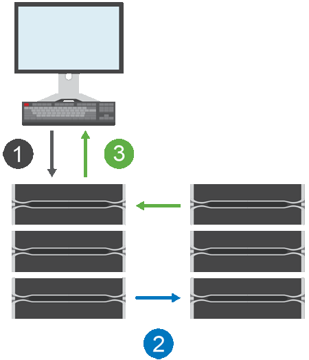

= Come funziona il mirroring sincrono
:allow-uri-read: 
:icons: font
:imagesdir: ../media/

[role="lead"]
Il mirroring sincrono replica i volumi di dati in tempo reale per garantire una disponibilità continua.

[NOTE]
====
Il mirroring non è disponibile sullo storage array EF600 o EF300.

====
Il mirroring sincrono raggiunge un obiettivo RPO (Recovery Point Objective) pari a zero dati persi grazie alla disponibilità di una copia dei dati importanti in caso di disastro su uno dei due array di storage. La copia è identica ai dati di produzione in ogni momento perché ogni volta che viene eseguita una scrittura nel volume primario, viene eseguita una scrittura nel volume secondario. L'host non riceve una conferma che la scrittura è riuscita fino a quando il volume secondario non viene aggiornato correttamente con le modifiche apportate sul volume primario.

Questo tipo di mirroring è ideale per scopi di business continuity come il disaster recovery.

== Relazione di mirroring sincrono

Una relazione di mirroring sincrono è costituita da un volume primario e da un volume secondario su storage array separati. L'array di storage contenente il volume primario si trova in genere nel sito primario e serve gli host attivi. L'array di storage contenente il volume secondario si trova in genere in un sito secondario e contiene una replica dei dati. Il volume secondario viene utilizzato se l'array di storage del volume primario non è disponibile a causa, ad esempio, di un'interruzione dell'alimentazione completa, di un incendio o di un guasto hardware nel sito primario.

== Sessione di mirroring sincrono

Il processo di configurazione del mirroring sincrono prevede la configurazione dei volumi in coppie. Dopo aver creato una coppia mirrorata, costituita da un volume primario su un array di storage e da un volume secondario su un altro array di storage, è possibile avviare il mirroring sincrono. Di seguito sono illustrate le fasi del mirroring sincrono.

. Una scrittura proviene dall'host.
. La scrittura viene inviata al volume primario, propagata al sistema remoto e quindi inviata al volume secondario.
. L'array di storage del volume primario invia un messaggio di completamento i/o al sistema host _dopo_ che entrambe le operazioni di scrittura sono state completate correttamente.

La capacità riservata viene utilizzata per registrare le informazioni sulla richiesta di scrittura in entrata da un host.

Quando l'attuale proprietario del controller del volume primario riceve una richiesta di scrittura da un host, il controller registra prima le informazioni sulla scrittura nella capacità riservata del volume primario. Quindi, scrive i dati nel volume primario. Quindi, il controller avvia un'operazione di scrittura remota per copiare i blocchi di dati interessati nel volume secondario dell'array di storage remoto.

Poiché l'applicazione host deve attendere che la scrittura avvenga sull'array di storage locale e sulla rete dell'array di storage remoto, È necessaria una connessione molto rapida tra lo storage array locale e lo storage array remoto per mantenere la relazione di mirroring senza ridurre eccessivamente le performance di i/o locale.

== Disaster recovery

Il mirroring sincrono mantiene una copia dei dati fisicamente distanti dal sito in cui risiedono i dati. Se si verifica un disastro nel sito primario, ad esempio un'interruzione dell'alimentazione o un flusso, è possibile accedere rapidamente ai dati dal sito secondario.

Il volume secondario non è disponibile per ospitare le applicazioni durante l'operazione di mirroring sincrono, pertanto, in caso di disastro nell'array di storage locale, è possibile eseguire il failover nell'array di storage remoto. Per eseguire il failover, promuovere il volume secondario al ruolo primario. Quindi, l'host di ripristino può accedere al volume appena promosso e le operazioni di business possono continuare.

== Impostazioni di sincronizzazione

Quando si crea una coppia mirrorata, si definiscono anche la priorità di sincronizzazione e il criterio di risincronizzazione utilizzati dalla coppia mirrorata per completare l'operazione di risincronizzazione dopo un'interruzione della comunicazione.

Se il collegamento di comunicazione tra i due array di storage smette di funzionare, gli host continuano a ricevere riconoscimenti dall'array di storage locale, impedendo una perdita di accesso. Quando il collegamento di comunicazione funziona di nuovo, i dati non replicati possono essere risincronati automaticamente o manualmente nell'array di storage remoto.

La risincronizzazione automatica dei dati dipende dalla policy di risincronizzazione della coppia mirrorata. Un criterio di risincronizzazione automatica consente alla coppia mirrorata di risincronizzarsi automaticamente quando il collegamento funziona di nuovo. Un criterio di risincronizzazione manuale richiede di riprendere manualmente la sincronizzazione dopo un problema di comunicazione. La risincronizzazione manuale è la policy consigliata.

È possibile modificare le impostazioni di sincronizzazione per una coppia mirrorata solo sull'array di storage che contiene il volume primario.

== Dati non sincronizzati

I volumi primario e secondario non vengono sincronizzati quando l'array di storage del volume primario non è in grado di scrivere i dati nel volume secondario. Ciò può essere causato dai seguenti problemi:

* Problemi di rete tra gli array di storage locali e remoti
* Un volume secondario guasto
* La sincronizzazione viene sospesa manualmente sulla coppia mirrorata

== Coppia mirrorata orfana

Un volume di coppia di mirroring orfano esiste quando un volume membro è stato rimosso da un lato (lato primario o secondario) ma non dall'altro.

I volumi di coppia di mirroring orfani vengono rilevati quando viene ripristinata la comunicazione tra array e i due lati della configurazione di mirroring riconciliano i parametri di mirroring.

È possibile rimuovere una coppia mirrorata per correggere uno stato di coppia mirrorata orfana.

== Configurazione e gestione

Per abilitare e configurare il mirroring tra due array, è necessario utilizzare l'interfaccia di Unified Manager. Una volta attivato il mirroring, è possibile gestire le coppie mirrorate e le impostazioni di sincronizzazione in System Manager.
