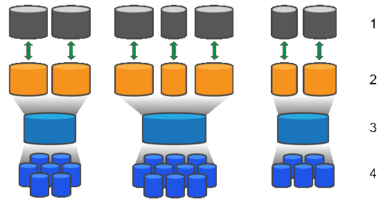

= Funzionamento di pool e gruppi di volumi
:allow-uri-read: 
:icons: font
:imagesdir: ../media/

[role="lead"]
Per eseguire il provisioning dello storage, creare un pool o un gruppo di volumi che conterrà i dischi rigidi (HDD) o SSD (Solid state Disk) che si desidera utilizzare nell'array di storage.

L'hardware fisico viene fornito in componenti logici in modo che i dati possano essere organizzati e recuperati facilmente. Sono supportati due tipi di raggruppamenti:

* Piscine
* Gruppi di volumi RAID

I pool e i gruppi di volumi sono le unità di storage di livello superiore in un array di storage: Suddividono la capacità dei dischi in divisioni gestibili. All'interno di queste divisioni logiche si trovano i singoli volumi o LUN in cui sono memorizzati i dati. La figura seguente illustra questo concetto.

^1^ LUN host; ^2^ volumi; ^3^ gruppi di volumi o pool; ^4^ dischi HDD o SSD

Quando viene implementato un sistema storage, il primo passo consiste nel presentare la capacità disponibile dei dischi ai vari host:

* Creazione di pool o gruppi di volumi con capacità sufficiente
* Aggiunta del numero di dischi necessari per soddisfare i requisiti di performance al pool o al gruppo di volumi
* Selezione del livello di protezione RAID desiderato (se si utilizzano gruppi di volumi) per soddisfare specifici requisiti di business

È possibile avere pool o gruppi di volumi sullo stesso sistema di storage, ma un'unità non può far parte di più di un pool o gruppo di volumi. I volumi presentati agli host per i/o vengono quindi creati utilizzando lo spazio nel pool o nel gruppo di volumi.

== Piscine

I pool sono progettati per aggregare i dischi rigidi fisici in un ampio spazio di storage e fornire una protezione RAID avanzata per l'IT. Un pool crea molti set RAID virtuali dal numero totale di dischi assegnati al pool e distribuisce i dati in modo uniforme tra tutti i dischi partecipanti. In caso di perdita o aggiunta di un disco, System Manager ribilancia dinamicamente i dati su tutti i dischi attivi.

I pool funzionano come un altro livello RAID, virtualizzando l'architettura RAID sottostante per ottimizzare le performance e la flessibilità durante l'esecuzione di attività come la ricostruzione, l'espansione del disco e la gestione della perdita del disco. System Manager imposta automaticamente il livello RAID a 6 in una configurazione 8+2 (otto dischi dati più due dischi di parità).

=== Corrispondenza dei dischi

È possibile scegliere tra HDD o SSD da utilizzare nei pool; tuttavia, come per i gruppi di volumi, tutti i dischi nel pool devono utilizzare la stessa tecnologia. I controller selezionano automaticamente i dischi da includere, quindi è necessario assicurarsi di disporre di un numero sufficiente di dischi per la tecnologia scelta.

=== Gestione dei dischi guasti

I pool hanno una capacità minima di 11 dischi; tuttavia, la capacità di un disco è riservata alla capacità di riserva in caso di guasto di un disco. Questa capacità di riserva è denominata "`capacità di conservazione`".

Quando vengono creati i pool, viene preservata una certa quantità di capacità per l'utilizzo in caso di emergenza. Questa capacità è espressa in termini di un numero di dischi in System Manager, ma l'implementazione effettiva è distribuita nell'intero pool di dischi. La quantità predefinita di capacità conservata si basa sul numero di dischi nel pool.

Una volta creato il pool, è possibile modificare il valore della capacità di conservazione su una capacità maggiore o minore oppure impostarlo su una capacità di conservazione non pari a 0 unità. La capacità massima che è possibile conservare (espressa come numero di dischi) è 10, ma la capacità disponibile potrebbe essere inferiore, in base al numero totale di dischi nel pool.

== Gruppi di volumi

I gruppi di volumi definiscono il modo in cui la capacità viene assegnata ai volumi nel sistema di storage. I dischi sono organizzati in gruppi RAID e i volumi risiedono tra i dischi di un gruppo RAID. Pertanto, le impostazioni di configurazione dei gruppi di volumi identificano i dischi che fanno parte del gruppo e il livello RAID utilizzato.

Quando si crea un gruppo di volumi, i controller selezionano automaticamente le unità da includere nel gruppo. È necessario scegliere manualmente il livello RAID per il gruppo. La capacità del gruppo di volumi corrisponde al numero totale di dischi selezionati, moltiplicato per la capacità.

=== Corrispondenza dei dischi

Per le dimensioni e le prestazioni, è necessario associare le unità del gruppo di volumi. Se nel gruppo di volumi sono presenti dischi più piccoli e più grandi, tutti i dischi vengono riconosciuti come la capacità più piccola. Se nel gruppo di volumi sono presenti dischi più lenti e veloci, tutti i dischi vengono riconosciuti alla velocità più bassa. Questi fattori influiscono sulle performance e sulla capacità complessiva del sistema storage.

Non è possibile combinare diverse tecnologie di dischi (dischi HDD e SSD). RAID 3, 5 e 6 sono limitati a un massimo di 30 dischi. RAID 1 e RAID 10 utilizzano il mirroring, pertanto questi gruppi di volumi devono avere un numero pari di dischi.

=== Gestione dei dischi guasti

I gruppi di volumi utilizzano i dischi hot spare come standby nel caso in cui un disco si guasti in volumi RAID 1/10, RAID 3, RAID 5 o RAID 6 contenuti in un gruppo di volumi. Un'unità hot spare non contiene dati e aggiunge un altro livello di ridondanza all'array di storage.

Se un disco si guasta nell'array di storage, il disco hot spare viene sostituito automaticamente per il disco guasto senza richiedere uno swap fisico. Se il disco hot spare è disponibile quando si verifica un guasto, il controller utilizza i dati di ridondanza per ricostruire i dati dal disco guasto al disco hot spare.
